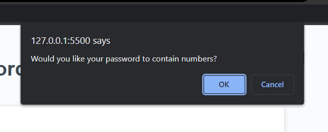

# Password-Generator

## Description
This repository links to a password generator, in which a password will be created using certain criteria selected by the user. The user is prompted to choose their password length and whether the password should contain a combination of lowercase and/or uppercase letters, numbers, and special characters. Once they have responded to all the prompts and click "Generate" the password is displayed on the screen. I learned how to manipulate code through JavaScript in order to have a dynamic webpage. 

## Usage

Here is the series of prompts for the user to select their criteria. 

Along with a screenshot of a randomly generated password displayed on the page. 

## Credits

I received collaborative brainstorming and help from classmate Joshua Taylor and tutor Andrew Tirpok, as well as TA Luis Pineda. 

## Link to live site

https://porkchoppy.github.io/password-generator